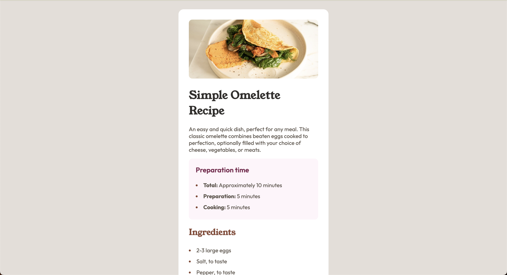

# Frontend Mentor - Recipe page solution

This is a solution to the [Recipe page challenge on Frontend Mentor](https://www.frontendmentor.io/challenges/recipe-page-KiTsR8QQKm).

## Table of contents

- [Overview](#overview)
  - [Screenshot](#screenshot)
  - [Links](#links)
- [My process](#my-process)
  - [Built with](#built-with)
  - [What I learned](#what-i-learned)
  - [Useful resources](#useful-resources)
- [Author](#author)

## Overview

### Screenshot



### Links

- Solution URL: [click here](https://github.com/hein99/recipe-page)
- Live Site URL: [click here](https://hein99.github.io/recipe-page)

## My process

### Built with

- Semantic HTML5 markup
- CSS custom properties
- Flexbox
- Mobile-first workflow

### What I learned

I learned using [Css custom properties](https://developer.mozilla.org/en-US/docs/Web/CSS/Using_CSS_custom_properties) and [`@font-face`](https://developer.mozilla.org/en-US/docs/Web/CSS/@font-face) to use custom font.

I used Css custom properties below:

```css
:root {
  --primary-nutmeg: hsl(14, 45%, 36%);
  --primary-dark-raspberry: hsl(332, 51%, 32%);

  --neutral-white: hsl(0, 0%, 100%);
  --neutral-rose-white: hsl(330, 100%, 98%);
  --neutral-eggshell: hsl(30, 54%, 90%);
  --neutral-light-grey: hsl(30, 18%, 87%);
  --neutral-wenge-brown: hsl(30, 10%, 34%);
  --dark-charcoal: hsl(24, 5%, 18%);

  --title-font-family: 'Young Serif', serif;
  --text-font-family: 'Outfit', san-serif;
}
```

The following code is the example of `@font-face`

```css
@font-face {
  font-family: 'Outfit';
  src: url('./assets/fonts/outfit/Outfit-VariableFont_wght.ttf');
}
```

### Useful resources

- [MDN Web Docs](https://developer.mozilla.org/en-US/docs/Learn) - This documentation helped me a lot!

## Author

- Website - [Hein Kaung Khant](https://heinkaungkhant.com/)
- Frontend Mentor - [@hein99](https://www.frontendmentor.io/profile/hein99)
- Twitter - [@sudoHein](https://twitter.com/sudoHein)
